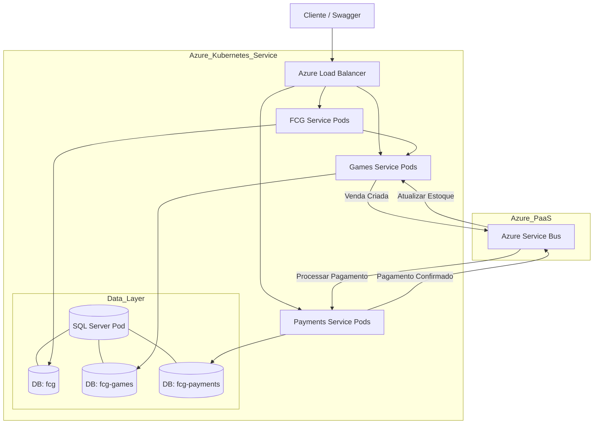

# ?? Apresentação Técnica: Deploy de Microsserviços FCG no Azure Kubernetes Service

---

## ?? **1. Visão Geral do Projeto**

O projeto **FCG (Full Game Commerce)** é uma arquitetura de **microsserviços** desenvolvida em **.NET 8** para gerenciar um sistema completo de comércio de jogos digitais. A solução foi projetada para ser escalável, resiliente e distribuída.

### **Componentes da Solução:**
- **FCG Service**: API principal (Gateway/BFF) para gerenciamento de clientes e orquestração de vendas.
- **Games Service**: Gerenciamento de catálogo de jogos e controle de estoque.
- **Payments Service**: Processamento seguro de pagamentos.
- **Azure Service Bus**: Backbone de mensageria para comunicação assíncrona.
- **SQL Server**: Banco de dados relacional (implementando o padrão *Database per Service*).

---

## ??? **2. Arquitetura da Solução**

A infraestrutura é hospedada no Microsoft Azure, utilizando serviços gerenciados para garantir alta disponibilidade e menor overhead operacional.



---

## ?? **3. Conceitos Fundamentais (Deep Dive)**

Para entender o deploy, é essencial compreender os blocos de construção do Kubernetes e da Nuvem.

### **3.1. Kubernetes (K8s)**
É uma plataforma open-source para automatizar o deploy, o escalonamento e o gerenciamento de aplicações em containers.

- **Cluster**: É o conjunto de máquinas (físicas ou virtuais) que rodam o Kubernetes. É composto por um *Control Plane* (cérebro) e *Nodes* (trabalhadores). No Azure, usamos o **AKS (Azure Kubernetes Service)**, onde a Microsoft gerencia o Control Plane gratuitamente e pagamos apenas pelos Nodes.
  
- **Node (Nó)**: É uma máquina de trabalho (VM) no Kubernetes. Cada nó possui os serviços necessários para rodar **Pods** (como o Docker/containerd e o Kubelet). No nosso projeto, usamos nós do tipo `Standard_D2s_v3` (2 vCPUs, 8GB RAM).

- **Pod**: É a menor unidade implantável no Kubernetes. Um Pod encapsula um ou mais containers (geralmente Docker) que compartilham armazenamento e rede. Pense no Pod como uma "instância lógica" da sua aplicação rodando.

- **Deployment**: É um objeto que gerencia os Pods. Ele garante que um número específico de réplicas do Pod esteja sempre rodando. Se um Pod falhar, o Deployment cria outro automaticamente (*Self-healing*). Também permite atualizações de versão sem downtime (*Rolling Updates*).

- **Service**: É uma abstração que define um conjunto lógico de Pods e uma política para acessá-los. Como os Pods são efêmeros (têm IPs que mudam), o Service fornece um IP fixo e DNS para comunicação estável.
  - **ClusterIP**: Exposição interna (padrão).
  - **LoadBalancer**: Exposição externa usando um Load Balancer do provedor de nuvem (Azure LB).

- **Namespace**: É uma forma de dividir os recursos do cluster entre múltiplos usuários ou projetos. É como um "cluster virtual". Usamos o namespace `fcg-tutorial` para isolar nossos recursos.

- **Secret**: Objeto para armazenar dados sensíveis (senhas, chaves de API, connection strings). O Kubernetes codifica esses dados em Base64 e os injeta nos Pods de forma segura, evitando que fiquem expostos no código.

- **ConfigMap**: Similar ao Secret, mas para dados não sensíveis (arquivos de configuração, scripts SQL, variáveis de ambiente).

- **Job**: Cria um ou mais Pods e garante que um número especificado deles termine com sucesso. Usamos para tarefas de inicialização, como criar os bancos de dados no SQL Server.

### **3.2. Auto Scaling (HPA)**
O **Horizontal Pod Autoscaler (HPA)** escala automaticamente o número de Pods em um Deployment com base na utilização de CPU ou memória observada.
- **Scale Out**: Aumenta o número de Pods quando a demanda sobe.
- **Scale In**: Diminui o número de Pods quando a demanda cai, economizando recursos.

### **3.3. Azure Service Bus**
Serviço de mensageria empresarial totalmente gerenciado (Message Broker).
- **Queue (Fila)**: Modelo *Point-to-Point*. O remetente envia uma mensagem e **apenas um** receptor a processa. Garante que cada ordem de venda seja processada uma única vez.

---

## ?? **4. Passo a Passo do Deploy (`deploy-with-servicebus.bat`)**

O script automatiza todo o processo de infraestrutura e deploy. Abaixo, o detalhamento técnico de cada etapa.

### **Passo 1: Autenticação e Contexto**
```cmd
az login
```
Estabelece a identidade do usuário e o contexto de segurança para interagir com a API do Azure Resource Manager (ARM).

### **Passo 2: Grupo de Recursos (Resource Group)**
```cmd
az group create --name FCG-Infra --location eastus
```
Cria um container lógico no Azure. O ciclo de vida de todos os recursos (AKS, Service Bus, IPs) está atrelado a este grupo, facilitando o gerenciamento e a exclusão.

### **Passo 3: Infraestrutura de Mensageria**
```cmd
az servicebus namespace create ...
az servicebus queue create ...
```
Provisiona o namespace do Service Bus e as 3 filas essenciais:
1. `sale-processing-queue`: Desacopla a criação da venda do seu processamento.
2. `payment-processing-queue`: Fila de trabalho para o gateway de pagamento.
3. `response-payment-processing-queue`: Retorno assíncrono do status do pagamento.

### **Passo 4: Provisionamento do Cluster AKS**
```cmd
az aks create --name FCG-Cluster --node-count 1 ...
```
Cria o cluster Kubernetes gerenciado.
- **Control Plane**: Provisionado pela Microsoft (transparente para nós).
- **Node Pool**: Criação do *Virtual Machine Scale Set* com 1 VM Linux para rodar nossos containers.
- **Networking**: Configuração automática de VNETs e Load Balancers.

### **Passo 5: Configuração do Ambiente Kubernetes**
1. **Namespace**: Criação do `fcg-tutorial`.
2. **Secrets**: A Connection String do Service Bus (obtida via Azure CLI) é salva como um Kubernetes Secret. Isso permite que as aplicações acessem o Service Bus sem ter a senha "hardcoded" no código fonte.

### **Passo 6: Camada de Dados (SQL Server)**
Uma estratégia robusta de inicialização é utilizada:
1. **Deployment**: Sobe o container do SQL Server 2022.
2. **Probes**:
   - *Readiness Probe*: Verifica via TCP (porta 1433) se o banco está aceitando conexões. O Kubernetes não envia tráfego até que este teste passe.
   - *Liveness Probe*: Reinicia o container se o SQL Server travar.
3. **Job de Inicialização**: Um Job separado aguarda o SQL Server ficar "Ready" e então executa scripts SQL para criar os 3 bancos de dados (`fcg`, `fcg-games-dev`, `fcg-payments-dev`), garantindo o isolamento de dados.

### **Passo 7: Deploy dos Microsserviços**
Aplica os manifestos YAML para FCG, Games e Payments.
- **Injeção de Dependência**: As Connection Strings e configurações do Service Bus são injetadas como variáveis de ambiente nos containers, lidas diretamente do Secret criado anteriormente.
- **Migrations**: Ao iniciar, cada aplicação .NET executa automaticamente o `EF Core Migrate` para criar suas tabelas no banco de dados respectivo.

### **Passo 8: Exposição Externa (Networking)**
```cmd
kubectl patch service ... {"type":"LoadBalancer"}
```
Altera o tipo do serviço para `LoadBalancer`. O Cloud Controller Manager do Azure detecta essa mudança e provisiona automaticamente um **Azure Public IP** e configura as regras de NAT para encaminhar tráfego da internet para os Pods corretos.

### **Passo 9: Configuração de Auto Scaling (HPA)**
Aplica as regras de escalabilidade:
- **FCG**: 1 a 5 réplicas (CPU > 70%).
- **Games**: 1 a 10 réplicas (CPU > 70%).
- **Payments**: 2 a 8 réplicas (Mínimo de 2 para alta disponibilidade).

---

## ?? **5. Recursos Criados**

| Recurso | Tipo | Função |
|---------|------|--------|
| **FCG-Infra** | Resource Group | Agrupamento lógico e ciclo de vida. |
| **FCG-Cluster** | AKS Cluster | Orquestrador de containers. |
| **fcg-games-servicebus** | Service Bus | Broker de mensagens. |
| **sqlserver** | Pod/Deployment | Banco de dados centralizado (multi-tenant lógico). |
| **fcg-app** | Pod/Deployment | API Gateway / BFF. |
| **games-app** | Pod/Deployment | Domínio de Jogos e Estoque. |
| **payments-app** | Pod/Deployment | Domínio de Pagamentos. |
| **Public IPs** | Networking | Pontos de entrada para as APIs (Swagger). |

---

## ?? **6. Estimativa de Custos (Mensal - East US)**

Uma estimativa aproximada para manter este ambiente de laboratório rodando 24/7:

| Serviço | Configuração | Custo Est. |
|---------|--------------|------------|
| **AKS (VM)** | 1x Standard_D2s_v3 (2 vCPU, 8GB) | ~$70.00 |
| **Discos Gerenciados** | 1x 128GB SSD Premium (OS Disk) | ~$10.00 |
| **Service Bus** | Standard Tier (Base + Operações) | ~$10.00 |
| **Load Balancer** | Regras e Processamento de Dados | ~$15.00 |
| **IPs Públicos** | 3 IPs Estáticos | ~$10.00 |
| **Total** | | **~$115.00** |

*Nota: Para ambientes de produção, recomenda-se no mínimo 3 nós para o cluster e SQL Server gerenciado (Azure SQL Database), o que aumentaria os custos.*

---

## ?? **7. Limpeza do Ambiente**

Para evitar cobranças contínuas após a apresentação, o comando abaixo destrói **todos** os recursos criados:

```cmd
az group delete --name FCG-Infra --yes --no-wait
```

---

## ? **8. Conclusão**

Esta demonstração comprova a viabilidade e eficiência de uma arquitetura Cloud-Native no Azure. Utilizamos práticas modernas de DevOps e SRE, como:
- **Infraestrutura como Código (IaC)** via scripts e manifestos YAML.
- **Observabilidade** através de Probes e Logs.
- **Resiliência** com Self-healing e Mensageria Assíncrona.
- **Escalabilidade** automática com HPA.
- **Segurança** com gerenciamento de Secrets.

O resultado é um sistema robusto, pronto para escalar e fácil de manter.
